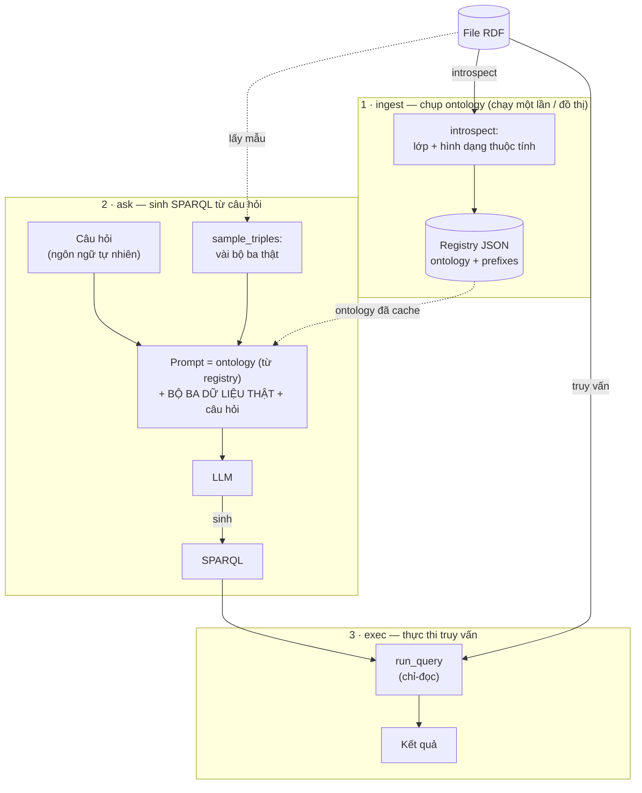

# Xây công cụ Text-to-SPARQL truy vấn đồ thị tri thức bằng LLM mã nguồn mở

> Hướng dẫn tự xây dựng một công cụ biến câu hỏi ngôn ngữ tự nhiên thành truy vấn SPARQL cho dữ liệu RDF / knowledge graph — từ đầu đến cuối.

## Bài toán

Rất nhiều kiến thức thế giới thực được biểu diễn dưới dạng **đồ thị tri thức (knowledge graph)** bằng RDF (Resource Description Framework) — từ Wikidata, DBpedia cho tới các kho dữ liệu doanh nghiệp — và được truy vấn bằng **SPARQL**. Nhưng SPARQL có cú pháp riêng, lại đòi hỏi nắm rõ *quy chuẩn* (ontology) của đồ thị: các lớp, thuộc tính, namespace. Mục tiêu của chúng ta là để một người không rành SPARQL vẫn "hỏi" được đồ thị bằng ngôn ngữ tự nhiên.

Toàn bộ hệ thống chạy **nội bộ (self-hosted)**: dùng một LLM mã nguồn mở qua endpoint tương thích OpenAI (ví dụ [Ollama](https://ollama.com)), nên quy chuẩn lẫn dữ liệu nhạy cảm không rời khỏi hạ tầng của bạn.

### Vì sao SPARQL "khó nhằn" hơn SQL?

Trong SQL, dữ liệu rất tường minh: có bảng, có cột, có khoá ngoại. Còn RDF thì "phẳng" — tất cả chỉ là các bộ ba `(chủ thể, vị từ, đối tượng)`. Không có "bảng" hay "cột" khai báo sẵn; cấu trúc nằm ẩn trong chính dữ liệu.

Vì vậy, thay vì đọc một bảng metadata có sẵn như `pg_catalog`, ta phải tự ** nội suy ra cấu trúc từ dữ liệu**: có những lớp nào, mỗi lớp thường đi với những thuộc tính nào, kiểu dữ liệu của thuộc tính là gì. Đây là phần thú vị nhất — và cũng là phần trọng tâm cần giải quyết của bài toán.

### Ý tưởng cốt lõi: ontology context

Với một đồ thị cỡ vừa, cả ontology đủ nhỏ để **đưa trọn vào prompt**. Ta không cần vector store hay bước truy hồi nào cả — chỉ cần:

1. **Nội suy (introspect)** ontology: lớp + hình dạng thuộc tính.
2. Rút **vài bộ ba mẫu dữ liệu thật** để "neo" (grounding) mô hình vào IRI và cách các thực thể nối nhau.
3. Ghép cả hai vào prompt, để LLM sinh SPARQL, rồi thực thi.

Công cụ có ba lệnh, ứng với ba giai đoạn: **`ingest`** chụp ontology một lần, **`ask`** sinh SPARQL từ câu hỏi, **`exec`** chạy câu SPARQL đó.



## Cấu trúc dự án

Công cụ là một package Python nhỏ, cài bằng `pip install -e .` và chạy qua lệnh `text2sparql`. Toàn bộ mã nguồn nằm gọn trong năm module, mỗi module một trách nhiệm rõ ràng:

```
text2sparql-simple/
├── pyproject.toml          # metadata + phụ thuộc + entry point CLI
├── .env.example            # cấu hình mẫu (endpoint LLM, model, …)
├── text2sparql/
│   ├── __init__.py
│   ├── config.py           # đọc cấu hình từ biến môi trường
│   ├── graph.py            # RDF: nội suy ontology + thực thi SPARQL  ← xử lý chính
│   ├── llm.py              # gọi LLM qua OpenAI SDK
│   ├── engine.py           # điều phối: ingest + build prompt + self-repair
│   ├── cli.py              # giao diện dòng lệnh
└── examples/
    ├── shop_demo.ttl       # đồ thị mẫu 1: cửa hàng (schema.org)
    ├── acme_kg.ttl         # đồ thị mẫu 2: công ty (cây phân cấp, property path)
```

Thứ tự phụ thuộc cũng chính là thứ tự ta sẽ dựng từng phần: `config` ← `graph`/`llm` ← `engine` ← `cli`.

### Cấu hình dependency `pyproject.toml`

Điểm đáng chú ý: Công cụ demo chỉ cần dùng **3** dependency tối thiểu, chưa cần sử dụng các framework phức tạp như langchain

```toml
[project]
name = "text2sparql"
requires-python = ">=3.10"
dependencies = [
    "rdflib>=7.0",        # đọc mọi định dạng RDF + chạy SPARQL trong bộ nhớ
    "openai>=1.40",       # client cho MỌI endpoint tương thích OpenAI (kể cả Ollama)
    "python-dotenv>=1.0", # nạp .env
]

[project.scripts]
text2sparql = "text2sparql.cli:main"   # tạo lệnh `text2sparql` sau khi cài
```

- **`rdflib`** làm được cả hai việc nặng nhất: parse RDF (Turtle, RDF/XML, N-Triples, JSON-LD…) và **chạy SPARQL ngay trong bộ nhớ**. Không cần một triple store riêng.
- **`openai`** — một client duy nhất cho phép tương tác với tất cả endpoint *tương thích OpenAI*,

### Chuẩn bị môi trường

```bash
cd text2sparql-simple
python -m venv .venv && source .venv/bin/activate
pip install -e .
cp .env.example .env       # trỏ tới endpoint LLM của bạn

# LLM chạy nội bộ qua Ollama:
ollama pull gemma4:31b
ollama serve &
```

> Không cần mô hình embedding: ontology được đưa thẳng vào prompt nên không có bước vector nào.

## Bước 1 — Cấu hình (`config.py`)

Trước hết, một nơi tập trung đọc cấu hình. Vì đây là bản "đơn giản", ta giữ số biến ở mức tối thiểu. Điểm cốt lõi là **ba biến `LLM_*`** mô tả endpoint tương thích OpenAI:

```python
@dataclass
class Settings:
    # LLM sinh SPARQL, gọi qua OpenAI SDK. Bất kỳ endpoint tương thích OpenAI nào cũng chạy:
    llm_base_url: str = os.getenv("LLM_BASE_URL", "http://localhost:11434/v1")
    llm_model: str = os.getenv("LLM_MODEL", "gemma4:31b")
    llm_api_key: str = os.getenv("LLM_API_KEY", "")   # chỉ cần cho endpoint hosted
    request_timeout: float = float(os.getenv("TEXT2SPARQL_TIMEOUT", "180"))

    # Self-repair: tổng số lần sinh. Nếu truy vấn báo LỖI, lỗi được đưa ngược cho model sửa.
    max_attempts: int = int(os.getenv("TEXT2SPARQL_MAX_ATTEMPTS", "2"))

    data_dir: Path = Path(os.getenv("TEXT2SPARQL_DATA_DIR", ".text2sparql"))
```

Sử dụng thư viện `openai`, chúng ta có thể thay đổi từ môi trường local sang hosted chỉ bằng cách chỉnh sửa `LLM_BASE_URL` — không đụng tới code. `load_dotenv()` ở đầu module nạp `.env` để các giá trị này có sẵn khi khởi động.

## Bước 2 — Kết nối RDF: nội suy + thực thi (`graph.py`)

Đây là trái tim của công cụ. Module này lo hai việc: **suy ra ontology** từ dữ liệu và **chạy SPARQL**. Cả hai đều xoay quanh class `rdflib.Graph` của thư viện rdflib.

### 2a. Bọc nguồn RDF

```python
SCHEMA = Namespace("https://schema.org/")

class GraphSource:
    def __init__(self, source: str):
        self.source = source
        # bind_namespaces="none": KHÔNG nạp sẵn bảng prefix khổng lồ của rdflib
        self.graph = Graph(bind_namespaces="none")
        self.graph.parse(source)   # rdflib tự nhận diện định dạng
        # Tạo sẵn vài prefix cơ bản để SPARQL sinh ra đọc tự nhiên; @prefix của đồ thị được ưu tiên.
        for pfx, ns in (("rdf", RDF), ("rdfs", RDFS), ("owl", OWL),
                        ("xsd", XSD), ("skos", SKOS), ("schema", SCHEMA)):
            self.graph.namespace_manager.bind(pfx, ns, replace=False)
```

Chi tiết `bind_namespaces="none"` nhỏ nhưng quan trọng: nó giữ cho CURIE (ví dụ `schema:Order`) khớp đúng prefix mà file khai báo, thay vì bị rdflib đánh số `schema1:`.

### 2b. Nội suy ontology — `introspect()`

Vì RDF không có "lược đồ" tường minh, ta suy ra nó bằng chính SPARQL. **Đầu tiên, tìm mọi lớp** — cả lớp được khai báo (`owl:Class`) lẫn lớp thực sự có thực thể (`?s a ?cls`) — và lọc bỏ các từ vựng *meta* (rdf, rdfs, owl, xsd) vì chúng định nghĩa *ngôn ngữ* ontology chứ không phải *nghiệp vụ*:

```python
meta_filter = " ".join(f'FILTER(!STRSTARTS(STR(?cls), "{ns}"))' for ns in _META_NAMESPACES)
class_q = f"""
SELECT DISTINCT ?cls WHERE {{
  {{ ?cls a <{OWL.Class}> }} UNION {{ ?cls a <{RDFS.Class}> }} UNION {{ ?s a ?cls }}
  FILTER(isIRI(?cls))
  {meta_filter}
}} LIMIT {MAX_CLASSES}
"""
```

**Tiếp theo, với mỗi lớp**, tìm những vị từ (predicate) xuất hiện trên thực thể của nó, và xem giá trị là kiểu dữ liệu gì hay trỏ tới lớp nào — đây chính là "hình dạng" (shape) của lớp:

```python
prop_q = f"""
SELECT DISTINCT ?p ?dt ?otype WHERE {{
  ?s a <{iri}> ; ?p ?o .
  OPTIONAL {{ ?o a ?otype }}      # nếu đối tượng là một thực thể có kiểu
  BIND(DATATYPE(?o) AS ?dt)       # nếu đối tượng là literal
}} LIMIT {SAMPLE_LIMIT}
"""
```

Ta còn lấy thêm **cây phân cấp lớp** qua `rdfs:subClassOf` (rồi đảo cạnh để mỗi lớp cũng biết các lớp con của mình), và `rdfs:label`/`rdfs:comment` nếu có — chúng mang ngữ nghĩa nghiệp vụ quý giá như comment mô tả bảng/cột trong CSDL:

```python
sup_q = f"SELECT DISTINCT ?sup WHERE {{ <{iri}> <{RDFS.subClassOf}> ?sup . FILTER(isIRI(?sup)) }}"
for r in gs.query(sup_q):
    info.super_classes.append(gs.curie(str(r[0])))
```

Kết quả nội suy cho mỗi lớp được `ClassInfo.to_document()` dựng thành một "tài liệu" gọn — đây chính là phần lược đồ ta đưa vào prompt:

```
Class: schema:Order
Instances: 10
Properties (predicate -> range):
  - schema:customer -> schema:Person
  - schema:orderStatus -> xsd:string
  - schema:orderDate -> xsd:dateTime
  - schema:orderedItem -> schema:OrderItem
```

Chú ý `schema:customer -> schema:Person`: nó cho model biết đây là **liên kết tới lớp khác** — tương đương "khoá ngoại" trong thế giới SQL, và là manh mối để model biết cách "join".

### 2c. Neo mô hình vào dữ liệu thật — `sample_triples()`

Đây là bài học quan trọng nhất khi làm Text-to-SPARQL: **chỉ đưa lược đồ thôi là chưa đủ**. Nếu prompt chỉ mô tả lớp/thuộc tính ở mức trừu tượng, model không biết IRI thật của "Tom Becker" là gì (thường bịa ra `ex:TomBecker`), không biết các thực thể nối nhau ra sao, nên viết sai các truy vấn bắc cầu.

Giải pháp là **đưa kèm vài bộ ba RDF thật** rút trực tiếp từ đồ thị:

```python
def sample_triples(source, class_iris, max_subjects=12, per_class=2) -> str:
    gs = GraphSource(source)
    for iri in class_iris:
        # ORDER BY ?s để mẫu ỔN ĐỊNH giữa các lần chạy — LIMIT không sắp xếp sẽ tuỳ tiện,
        # khiến việc sinh truy vấn (và do đó cả eval) chập chờn.
        for r in gs.query(f"SELECT DISTINCT ?s WHERE {{ ?s a <{iri}> }} ORDER BY ?s LIMIT {per_class}"):
            # ... gom mọi bộ ba của ?s, in ra dạng Turtle rút gọn với CURIE
```

Mô hình lập tức "thấy" được hình dạng dữ liệu:

```turtle
ex:raj  a org:Manager, org:Employee, org:Person, org:Agent ;
  schema:name "Raj Patel" ; org:reportsTo ex:sofia ; org:hasSkill ex:python, ex:ml .
```

Chỉ với vài dòng này, model suy ra được: tìm người theo `schema:name`, đi chuỗi `reportsTo` để leo lên cấp trên. Một tinh chỉnh nhỏ nhưng đáng giá trong `_term_text`: số và boolean được in **không có ngoặc kép** (`500000`, `true`) để model viết FILTER số học đúng, còn `xsd:dateTime`… giữ hậu tố `^^` để model dùng đúng dạng literal.

### 2d. Thực thi truy vấn — `run_query()`

Kết quả SPARQL có nhiều dạng, nên ta chuẩn hoá về "cột + dòng". Bản đơn giản này **chỉ đọc** — chỉ nhận `SELECT` và `ASK`:

```python
def run_query(source: str, sparql: str) -> QueryResult:
    """Chạy truy vấn SELECT/ASK chỉ-đọc và chuẩn hoá kết quả. Giới hạn MAX_ROWS dòng."""
    gs = GraphSource(source)
    result = gs.query(sparql)

    if result.type == "ASK":                       # ASK → một boolean
        return QueryResult(["ask"], [[bool(result.askAnswer)]], 1, False)

    columns = [str(v) for v in result.vars]        # SELECT → binding của biến
    fetched = list(result)
    truncated = len(fetched) > MAX_ROWS
    rows = [[_json_safe(row[v]) for v in result.vars] for row in fetched[:MAX_ROWS]]
    return QueryResult(columns, rows, len(rows), truncated)
```

Các giới hạn (`MAX_CLASSES`, `SAMPLE_LIMIT`, `MAX_ROWS`) là hằng số cố định trong module — đủ cho một demo, và giữ ingest rẻ trên đồ thị lớn.

## Bước 3 — Gọi LLM (`llm.py`)

Ở đây chúng ta chọn thư viện `openai` kết hợp với **JSON mode** (`response_format={"type": "json_object"}`) để model trả về đúng cấu trúc ta cần:

```python
def generate_sparql(system_prompt: str, user_prompt: str) -> dict:
    """Hỏi LLM sinh SPARQL. Trả về {'sparql', 'explanation', 'classes_used'}."""
    client = OpenAI(
        base_url=settings.llm_base_url,
        api_key=settings.llm_api_key or "ollama",   # Ollama bỏ qua key nhưng SDK cần chuỗi khác rỗng
        timeout=settings.request_timeout,
    )
    resp = client.chat.completions.create(
        model=settings.llm_model,
        messages=[{"role": "system", "content": system_prompt},
                  {"role": "user", "content": user_prompt}],
        temperature=0,                               # xác định, để eval ổn định
        response_format={"type": "json_object"},     # ép trả JSON
    )
    return _parse(resp.choices[0].message.content or "")
```

Bộ parser được viết đơn giản — thử `json.loads` trước, nếu model lỡ bọc JSON trong văn bản thừa thì vớt lấy khối `{...}` ngoài cùng:

```python
def _parse(content: str) -> dict:
    try:
        data = json.loads(content)
    except (json.JSONDecodeError, TypeError):
        i, j = content.find("{"), content.rfind("}")
        data = json.loads(content[i:j+1]) if i != -1 and j > i else None
    if not isinstance(data, dict):
        return {"sparql": "", "explanation": "", "classes_used": []}   # để vòng self-repair xử lý
    return {"sparql": (data.get("sparql") or "").strip(), ...}
```

## Bước 4 — Điều phối (`engine.py`)

Module này ghép mọi thứ lại: định nghĩa **system prompt**, làm `ingest`, dựng prompt, và chạy vòng **self-repair**.

### 4a. System prompt — dạy model "luật chơi"

Prompt hệ thống nêu hợp đồng JSON và — quan trọng — một **ví dụ few-shot với ontology KHÁC** để model học *khuôn mẫu* (dùng property path, bám dữ liệu thật) chứ không nhại lại thuật ngữ:

```python
SYSTEM_PROMPT = """You are an expert in SPARQL and RDF knowledge graphs. Convert the user's
question into ONE SPARQL query for the graph described below.

You are given the graph's prefixes, its ontology (classes + properties), and a block of REAL
example triples. Ground your query in that example data: use its exact prefixes and IRIs, and
follow how the entities actually link together. Never invent classes, properties, or IRIs.

Respond with ONLY a JSON object:
{"sparql": "...", "explanation": "...", "classes_used": ["prefix:Class", ...]}
..."""
```

### 4b. `ingest()` — chụp nhanh ontology một lần

Vì ontology nhỏ, `ingest` **không** cần embedding hay kho vector. Nó chỉ chạy `introspect` một lần rồi **lưu** (danh sách lớp + tài liệu mô tả + bảng prefix) vào một registry JSON, để bước hỏi đáp khỏi nội suy lại:

```python
reg[graph_id] = {
    "name": name or graph_id,
    "source": source,
    "classes": ids,
    "documents": documents,   # tài liệu mô tả từng lớp — chính là context đưa cho model
    "prefixes": prefixes,
}
reg["_latest"] = graph_id     # nhớ đồ thị vừa nạp để lệnh sau khỏi phải chỉ --graph-id
```

### 4c. `_build_prompt()` — ráp prompt cuối cùng

Đây là nơi ba mảnh gặp nhau: **bảng prefix + toàn bộ ontology + bộ ba dữ liệu thật + câu hỏi**. SPARQL bắt buộc khai báo `PREFIX` cho mọi namespace, nên ta đưa sẵn bảng prefix để model viết CURIE thay vì IRI dài:

```python
def _build_prompt(question: str, meta: dict) -> str:
    context = "\n\n".join(meta.get("documents", []))         # ontology đã cache
    prefix_table = _prefix_block(meta.get("prefixes", {}))
    context_iris = [_expand(i, prefixes) for i in meta["classes"]]
    try:
        examples = graph.sample_triples(meta["source"], context_iris)
    except Exception:
        examples = ""   # lấy mẫu là best-effort; không bao giờ chặn việc sinh vì nó
    return (
        f"# Prefixes available:\n{prefix_table}\n\n"
        f"# Ontology (classes + property shapes):\n{context}\n\n"
        f"# Example instance data (REAL triples ...):\n{examples}\n\n"
        f"# Question: {question}"
    )
```

### 4d. Hai đường ra: `ask` và `execute`

Hai hàm tách bạch, phản ánh hai lệnh CLI. `ask` **chỉ sinh** SPARQL (không chạy); `execute` **chỉ chạy** một truy vấn thô (không sinh):

```python
def ask(question: str, graph_id=None) -> str:
    _, meta = _resolve(graph_id)
    return _to_ask_result(llm.generate_sparql(SYSTEM_PROMPT, _build_prompt(question, meta))).sparql

def execute(sparql: str, graph_id=None) -> "graph.QueryResult":
    _, meta = _resolve(graph_id)
    return graph.run_query(meta["source"], sparql)   # chỉ-đọc
```

### 4e. `answer()` — vòng tự sửa lỗi (self-repair)

CLI cố tình tách `ask` (sinh) khỏi `exec` (chạy) để người dùng luôn xem câu SPARQL trước. Nhưng để **chấm điểm tự động** thì cần một hàm chạy trọn vòng sinh → thực thi → tự sửa; đó là `answer()`, và lệnh `eval` dùng chính nó. Mô hình thỉnh thoảng viết sai cú pháp hoặc nhầm tên thuộc tính, nên nếu truy vấn **báo lỗi**, ta đưa nguyên thông báo lỗi ngược lại cho model và yêu cầu sửa, tối đa `max_attempts` lần:

```python
for attempt in range(1, settings.max_attempts + 1):
    last = _to_ask_result(llm.generate_sparql(SYSTEM_PROMPT, prompt))
    if not last.sparql:
        error = "model produced no SPARQL"
    else:
        try:
            qr = graph.run_query(meta["source"], last.sparql)
        except Exception as e:
            error = str(e)                 # lỗi → nạp vào prompt sửa
        else:
            return AnswerResult(ask=last, result=qr, attempts=attempt, error=None)
    if attempt < settings.max_attempts:
        prompt = base_prompt + _REPAIR.format(sparql=last.sparql or "(empty)", problem=error)
```

Một lựa chọn thiết kế quan trọng: ta **chỉ** tự sửa khi *lỗi*, chứ không sửa khi truy vấn hợp lệ nhưng trả về **0 dòng**. Với model nhỏ, ép sửa một câu "0 dòng" thường biến một truy vấn đúng thành sai — mà 0 dòng đôi khi lại chính là câu trả lời đúng.

## Bước 5 — Giao diện dòng lệnh (`cli.py`)

Cuối cùng, một `argparse` mỏng nối các hàm engine thành lệnh. Bốn lệnh, mỗi lệnh một trách nhiệm:

| Lệnh | Gọi | Việc |
|---|---|---|
| `ingest <source>` | `engine.ingest` | Nội suy + lưu ontology; in ra lược đồ đã bắt được |
| `ask "<câu hỏi>"` | `engine.ask` | **Chỉ in** câu SPARQL sinh ra (không chạy) |
| `exec "<SPARQL>"` | `engine.execute` | Chạy trực tiếp một truy vấn thô (chỉ-đọc) |

Lệnh `ingest` cố tình **in ra ontology nó bắt được** — để bạn thấy chính xác context nào được đưa cho model (minh bạch, dễ gỡ lỗi):

```python
if args.cmd == "ingest":
    res = engine.ingest(args.source, args.name)
    print(f"Ingested graph_id={res.graph_id} ... with {res.class_count} classes.")
    if not args.quiet:
        print("\nOntology captured (this is the context handed to the model):")
        for doc in res.documents:
            print(doc); print("-" * 60)
```

Tách `ask` (chỉ sinh) khỏi `exec` (chỉ chạy) là có chủ đích: nó luôn cho người dùng **xem câu SPARQL trước khi tin kết quả** — LLM có thể quên `PREFIX` hay hiểu nhầm câu hỏi, nên việc buộc phải xem-rồi-chạy là một tính năng an toàn, không phải phiền phức.

## Chạy thử

Đối với bài toán này, chúng ta sẽ chọn một mô hình LLM cỡ vừa nhưng lại có năng lực suy luận mạnh mẽ là `gemma4` phiên bản 31 tỷ parameters của Google trên Ollama. Các bạn có thể tham khảo cách sử dụng Ollama tại [bài viết này](https://atekco.io/1742436058042-ai-coding-2025-tu-trien-khai-ai-trong-tam-tay/)

Sau khi chạy Ollama và cài đặt model `gemma4:31b`, ta có thể chạy ứng dụng `text2sparql` như sau:

### Đồ thị 1 — cửa hàng (`shop_demo.ttl`, với bảng từ vựng schema.org)

Nạp đồ thị, rồi `ask` để **sinh** câu SPARQL:

```bash
text2sparql ingest examples/shop_demo.ttl
text2sparql ask "Which customer placed the most orders?"
```

Model tự dùng `schema:customer` để "đi" từ đơn hàng sang khách rồi gộp nhóm đếm — nhờ hình dạng `schema:Order -> schema:customer -> schema:Person` mà bước nội suy đã ghi lại:

```sparql
PREFIX ex: <http://example.org/shop#>
PREFIX schema: <https://schema.org/>
SELECT ?customerName
WHERE {
  ?order a schema:Order ;
          schema:customer ?customer .
  ?customer schema:name ?customerName .
}
GROUP BY ?customer ?customerName
ORDER BY DESC(COUNT(?order))
LIMIT 1
```

Xem xong thì `exec` để **chạy** đúng câu đó (chỉ-đọc):

```bash
text2sparql exec "PREFIX ex: <http://example.org/shop#> PREFIX schema: <https://schema.org/> SELECT ?customerName WHERE { ?order a schema:Order ; schema:customer ?customer . ?customer schema:name ?customerName . } GROUP BY ?customer ?customerName ORDER BY DESC(COUNT(?order)) LIMIT 1"
```

```
customerName
------------------------------------------------------------
Alice Nguyen
```

### Đồ thị 2 — công ty (`acme_kg.ttl`, bảng từ vựng phức tạp)

Với `examples/acme_kg.ttl`, sức mạnh thật của đồ thị lộ ra qua **property path** — thứ mà SQL cần `WITH RECURSIVE` dài dòng mới làm được. Quan hệ `org:reportsTo` chỉ lưu **một bước**, nên model dùng toán tử `+` để leo hết chuỗi quản lý:

```bash
text2sparql ingest examples/acme_kg.ttl
text2sparql ask "Who does Tom Becker report to, directly or indirectly?"
```

```sparql
PREFIX ex: <http://example.org/data#>
PREFIX org: <http://www.w3.org/ns/org#>
PREFIX schema: <https://schema.org/>
SELECT ?managerName WHERE {
  ?tom schema:name "Tom Becker" .
  ?tom org:reportsTo+ ?manager .
  ?manager schema:name ?managerName .
}
```

Chạy câu trên bằng `exec`:

```
managerName
------------------------------------------------------------
Mei Lin
Raj Patel
Sofia Reyes
```

Chú ý `org:reportsTo+`: từ Tom, model leo đúng chuỗi Tom → Mei Lin → Raj Patel → Sofia Reyes — điều nó chỉ suy ra được nhờ **thấy bộ ba dữ liệu thật** cho biết các thực thể nối nhau qua `reportsTo` như thế nào.

## Bước tiếp theo: mở rộng cho đồ thị lớn

Bài này cố tình giữ **gọn trong phạm vi demo**: một đồ thị nhỏ/vừa, cả ontology nhét trọn vào prompt, không embedding, không kho vector. Đó là lý do công thức thắng cuộc đơn giản đến bất ngờ.

Từ nền tảng này, hướng mở rộng đáng giá nhất là đưa công cụ lên **đồ thị/endpoint rất lớn** (DBpedia, Wikidata), nơi ontology hàng nghìn lớp không còn nhét trọn vào prompt và việc quét trực tiếp một đồ thị hàng triệu thực thể sẽ treo. Những công việc cần thêm:

- **Truy vấn từ xa (SPARQL endpoint).** `rdflib` bọc được cả endpoint từ xa qua `SPARQLStore` — cùng một lớp `Graph`, chỉ khác nguồn. `GraphSource.__init__` sẽ rẽ nhánh: URL → `SPARQLStore`, còn lại → `parse` tệp cục bộ.
- **Chọn lọc lược đồ (schema selection).** Thay vì đưa cả ontology, chỉ **truy hồi phần lược đồ liên quan** tới câu hỏi — khớp từ khoá + lan theo cạnh `rdfs:domain`/`rdfs:range`; embedding là phương án dự phòng. Đây là chỗ bước "RAG" thật sự xuất hiện, đặt trong `_build_prompt`.
- **Nạp ontology theo namespace.** Dữ liệu thuần không kèm định nghĩa lớp/thuộc tính; có thể **nạp ontology đã công bố tại chính namespace** (schema.org, W3C Org, SKOS, `dbo:`…) để làm giàu ngữ nghĩa cho bước chọn lọc.
- **Liên kết thực thể (entity linking).** Ánh xạ tên riêng trong câu hỏi ("Berlin") sang IRI thật (`dbr:Berlin`) trước khi sinh truy vấn — mấu chốt để chạy đúng trên KG thật.
- **Mô hình mạnh hơn khi cần chính xác tuyệt đối.** Prompt và phần grounding là *model-agnostic*, nên chỉ cần đổi `LLM_MODEL`/`LLM_BASE_URL` là đo lại được tác động.

## Kết luận

Chúng ta vừa dựng một công cụ Text-to-SPARQL đơn giản nhưng đầy đủ chức năng. Điểm cốt lõi cần nhớ: với RDF, cấu trúc không cho sẵn mà phải **suy ra từ dữ liệu**; và với đồ thị cỡ trung, chúng ta có thể sử dụng mô hình LLM cỡ vừa với đầy đủ context là đã có thể sử dụng được, chưa cần embedding hay RAG. Chúc các bạn dựng vui!
